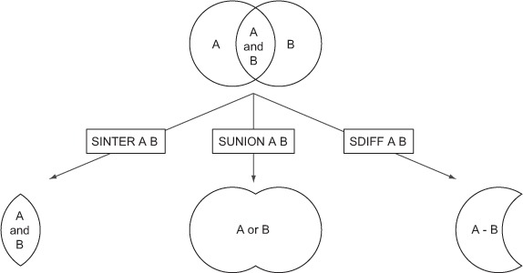

# learning-redis

* Installing Redis Server

```
wget -q http://download.redis.io/releases/redis-3.2.8.tar.gz
tar -xzf redis-3.2.8.tar.gz
cd redis-3.2.8 make
cd src && make all

cd redis-3.2.8 make insall
cd src && make install
```
* Installing python client

```
wget -q http://peak.telecommunity.com/dist/ez_setup.py
sudo python ez_setup.py
sudo python -m easy_install redis hiredis
```

* Running Redis Server
```
redis-server redis.conf
```


